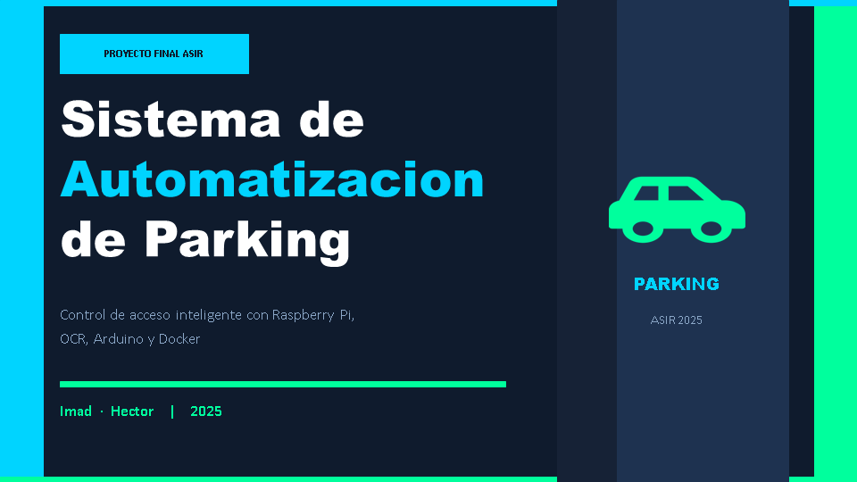
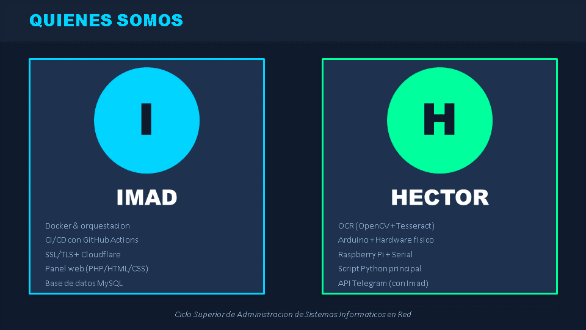
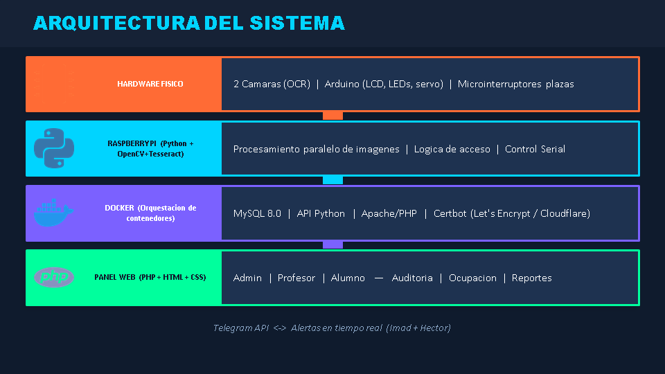
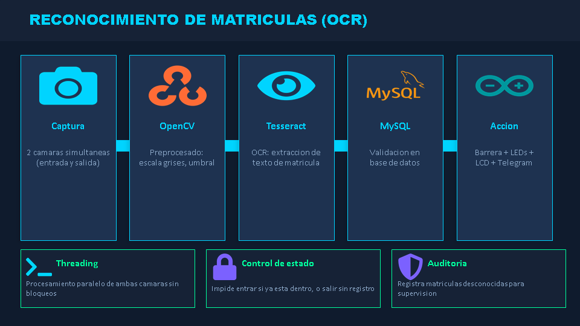
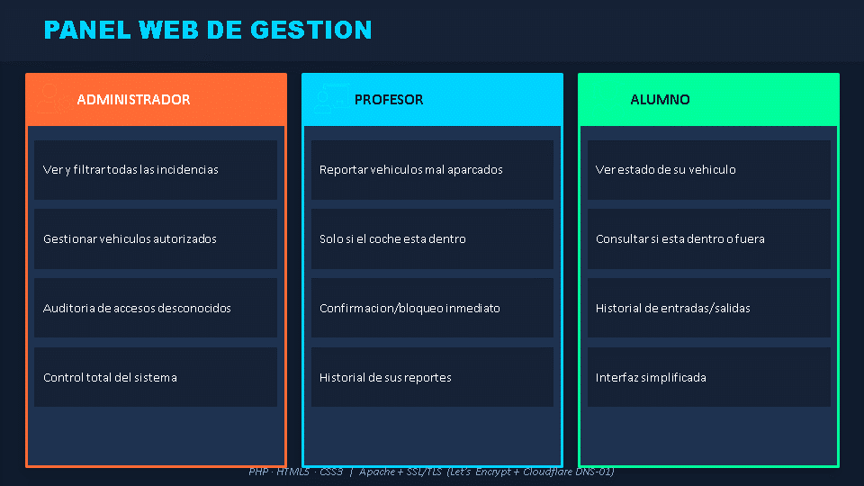
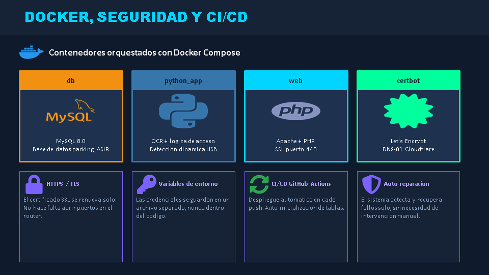
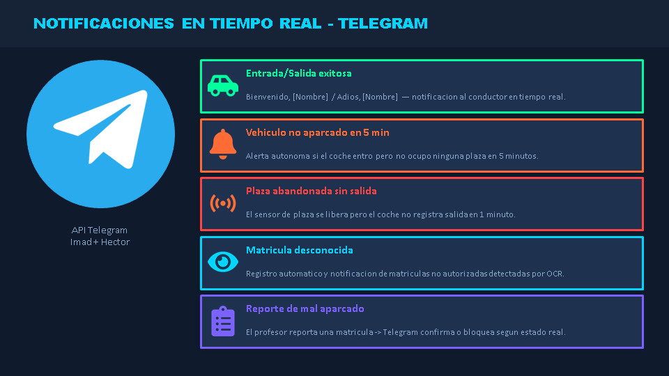
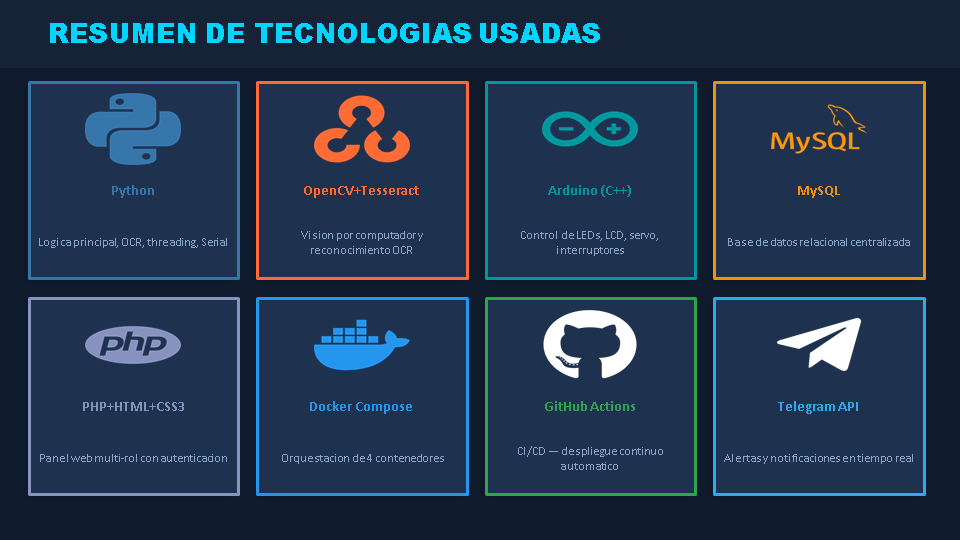
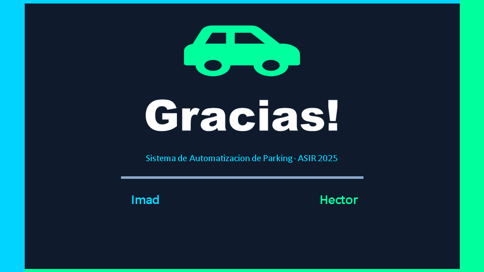

# Sistema de Automatización de Parking (Proyecto Final ASIR)

Bienvenido al repositorio de mi Proyecto Final para el ciclo superior de Administración de Sistemas Informáticos en Red (ASIR). Este proyecto nace con la idea de automatizar el control de acceso de vehículos a un recinto cerrado (parking), mejorando la seguridad, rapidez e integridad informática frente a los sistemas tradicionales de tickets o llaveros mecánicos.

## Sobre el Proyecto

El objetivo principal de este proyecto es integrar conocimientos de administración de sistemas, programación y hardware libre para crear una solución integral. El sistema es capaz de:

1. **Identificar Vehículos:** Usando reconocimiento óptico de caracteres (OCR) a través de dos cámaras simultáneas procesadas en paralelo.
2. **Validar Permisos:** Comprobar si el vehículo tiene autorización para entrar, basándose en registros centralizados en MySQL.
3. **Control de Estado del Vehículo:** El sistema impide que un coche entre si ya está dentro del parking, y que salga si no está registrado como dentro.
4. **Accionar Hardware:** Controlar mecánicamente una barrera de acceso e interactuar con el usuario a través de una pantalla LCD y semáforos LED.
5. **Gestión de Red Automática:** Al arrancar, la Raspberry Pi detecta su IP física y la muestra en la pantalla del Arduino para facilitar la conexión.
6. **Experiencia Personalizada:** El sistema saluda por su nombre a los conductores en la entrada (`Bienvenido, [Nombre]`) y les despide en la salida (`Adios, [Nombre]` / `Buen viaje!`).
7. **Reporte de Mal Aparcado Seguro:** Sistema para que los profesores notifiquen vehículos mal estacionados mediante la matrícula, bloqueando el reporte si el coche no se encuentra físicamente registrado dentro del parking.
8. **Notificaciones en Tiempo Real:** Integración bidireccional con la API de Telegram para enviar alertas automáticas y reportes de incidencias en tiempo real.
9. **Gestión Administrativa:** Panel de control para que el administrador audite y filtre todas las incidencias reportadas.
10. **Auditoría de Intentos No Autorizados:** Registro automático de matrículas desconocidas detectadas por el OCR para supervisar posibles intrusiones.
11. **Gestión de Ocupación en Tiempo Real:** Cálculo automático de plazas libres y ocupadas basado en el flujo de entradas y salidas registrado en la base de datos.
12. **Sensores Físicos de Aparcamiento:** Integración de microinterruptores que detectan en tiempo real si un vehículo está bien o mal aparcado en su plaza.
13. **Monitorización de Tiempos y Alertas:** Un temporizador interno vigila que el vehículo aparque correctamente en los 5 minutos posteriores a su entrada. Asimismo, si un vehículo aparcado deja su plaza (el sensor se pone verde) pero no registra su salida del recinto en un tiempo de gracia de 1 minuto, genera una alerta autónoma por Telegram.

## 📊 Presentación del Proyecto

A continuación, se expone la presentación oficial utilizada para defender este proyecto final. Puedes ver la portada directamente y desplegar el acordeón para visualizar todas las diapositivas en alta resolución, o bien descargar el archivo original.

<p align="center">
  <a href="./Parking_ASIR_Imad_Hector.pptx" target="_blank">
    
  </a>
</p>

<details>
  <summary><b>📖 Desplegar y ver las 9 diapositivas de la presentación</b></summary>
  <br>
  <p align="center">
    <br><br>
    <br><br>
    <br><br>
    <br><br>
    <br><br>
    <br><br>
    <br><br>
    
  </p>
</details>

<p align="center">
  <b>📥 <a href="./Parking_ASIR_Imad_Hector.pptx">Descargar Presentación (.pptx)</a></b>
</p>

---

## Estructura del Repositorio

El repositorio se divide para separar la funcionalidad técnica de la documentación general:

- 📂 **[`aplicacion-parking/`](./aplicacion-parking/)**: Esta carpeta contiene el **núcleo de la aplicación**. Aquí encontrarás todos los scripts en Python (OpenCV, Tesseract), los ficheros para la placa Arduino y utilidades en consola.
- 📂 **[`aplicacion-web/`](./aplicacion-web/)**: Contiene la **interfaz de administración y la base de datos**. Almacena el servidor web (PHP, HTML, CSS) y el esquema relacional MySQL usado para gestionar eficientemente qué vehículos están autorizados.

*(Nota: Tienes un `README.md` técnico específico dentro de cada una de estas carpetas detallando su instalación, cableado y requisitos.)*

## Tecnologías Principales y Disciplinas Aplicadas

En el desarrollo y conceptualización de este proyecto de ASIR se han tocado las siguientes ramas:
* **Sistemas Operativos:** Uso de automatismos en Linux y GitHub Actions para la descarga y ejecución de dependencias, y el flasheo automático del código de Arduino.
* **Fundamentos de Programación:** Desarrollo de la lógica central en Python con programación concurrente (threading) y programación de hardware en C++.
* **Hardware y Redes:** Intercomunicación del puerto Serial, control de 4 LEDs (semáforos de entrada y salida), display LCD I2C, servomotor para la barrera y microinterruptores mecánicos para las plazas.
* **Bases de Datos:** Almacenamiento, persistencia y consulta de estado en un SGBD relacional (MySQL/MariaDB).
* **Implantación de Aplicaciones Web:** Programación de interfaces y backend con PHP, HTML5 y CSS3.
* **Despliegue con Contenedores:** Orquestación de servicios (Base de datos, API Python y Web PHP) mediante Docker y Docker Compose, junto con CI/CD de despliegue continuo.

## 🚀 Despliegue Rápido con Docker

El proyecto cuenta con una configuración completa mediante **Docker Orquestado**. Puedes levantar todo el entorno de desarrollo y producción seguro con un solo comando:

```bash
docker compose up -d
```

Esto levantará los siguientes servicios en paralelo:
1. **db**: Contenedor MySQL 8.0 con la base de datos `parking_ASIR`.
2. **python_app**: Contenedor que ejecuta el procesamiento de imágenes (OpenCV + Tesseract) y la lógica de hardware, con detección dinámica de puertos USB del Arduino.
3. **web**: Contenedor Apache con PHP, configurado con soporte nativo de SSL/TLS (Puerto 443).
4. **certbot**: Contenedor de renovación de Let's Encrypt integrado con la API de Cloudflare para validación DNS-01 automática.

*(Puedes acceder a la aplicación web de forma segura en `https://tu-dominio.com` o a través del subdominio configurado).*

## 🔐 Configuración y Seguridad (HTTPS y APIs)

El sistema está completamente securizado y utiliza variables de entorno centralizadas. Sigue estos pasos para configurarlo:

1. Copia el archivo de ejemplo: `cp .env.example .env`
2. Edita el archivo `.env` e introduce las credenciales correspondientes:
   * **Telegram:** `TELEGRAM_BOT_TOKEN` y `TELEGRAM_CHAT_ID` para alertas automáticas.
   * **Base de Datos:** Credenciales seguras para MySQL (`DB_PASSWORD`, `DB_NAME`, etc.).
   * **SSL/TLS (Cloudflare):**
     * `DOMAIN_NAME`: Tu dominio o subdominio apuntando al servidor (soporta wildcards como `*.dominio.com`).
     * `CERTBOT_EMAIL`: Tu correo de registro para las alertas de Let's Encrypt.
     * `CLOUDFLARE_API_TOKEN`: Tu token de API con permisos de edición DNS en la zona de tu dominio.
3. El archivo `.env` está protegido por el `.gitignore` para asegurar la total privacidad de tus claves.

## 🛠️ Robustez, Auto-reparación y HTTPS Inteligente

Una de las características clave de este proyecto de fin de ciclo es su resiliencia y diseño auto-reparable:
*   **Arranque Seguro Sincronizado:** El contenedor web de Apache detecta si es la primera vez que se monta y espera automáticamente en bucle a que Certbot valide el dominio y descargue las firmas antes de iniciar la interfaz web. Cero fallos de arranque SSL.
*   **Validación DNS-01 (Sin Puertos Abiertos):** Al usar la API de Cloudflare para validar la propiedad del dominio, **no es necesario abrir el puerto 80 en tu router**, superando cualquier restricción de red de grado escolar o IPs locales de la Raspberry Pi.
*   **Gestión Dinámica de Hardware:** El script Python detecta dinámicamente el puerto USB asignado al Arduino. Ya no se rompe el despliegue al cambiar el hardware de puerto USB.
*   **Alertas Autónomas Inteligentes (Telegram):** El sistema notifica de forma autónoma al canal de Telegram si un vehículo excede los 5 minutos sin aparcar tras ingresar, o si abandona una plaza física sin registrar su salida del recinto en una ventana de gracia de 1 minuto, previniendo falsas alertas.
*   **Auto-inicialización de Base de Datos:** Tanto el backend web como el módulo Python crean las tablas necesarias al vuelo si no existen.
*   **Despliegue Continuo (CI/CD):** Actualizaciones integradas mediante GitHub Actions para una entrega de software robusta.

---
*Autores: Imad y Hector*