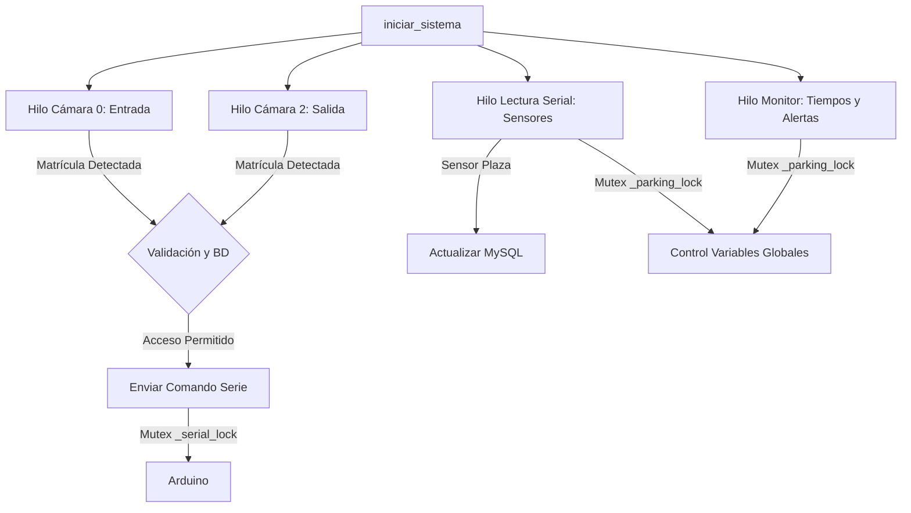

# 🛠️ Documentación Técnica: Módulo de Control de Parking (Python & Hardware)

Esta carpeta constituye el **núcleo de control de hardware y visión artificial** del sistema de parking automatizado. Almacena tanto el software central escrito en Python (`program.py`) que se ejecuta en la Raspberry Pi, como los diferentes firmwares de Arduino (`.ino`) y los scripts de automatización del despliegue.

---

## 📂 Mapa de Archivos de la Aplicación

Para asegurar un mantenimiento ordenado del repositorio, los componentes se distribuyen de la siguiente manera:

*   **`program.py`**: El cerebro multihilo del sistema. Gestiona el procesamiento OCR de cámaras, la sincronización de accesos con MySQL, el envío de alertas a Telegram y la intercomunicación serie con la placa controladora.
*   **`arduino.sh`**: Script de automatización en Bash. Descarga e instala localmente la herramienta de línea de comandos `arduino-cli` en arquitecturas ARM64 (Raspberry Pi), configurando automáticamente el entorno de compilación.
*   **`servo_and_lcd_serial/`**: Directorio del **firmware unificado de producción** para el Arduino.
    *   **`servo_and_lcd_serial.ino`**: Controla el servomotor de la barrera con giro amortiguado, semáforos LED, sensores físicos de plazas y pantalla LCD I2C de forma coordinada.
*   **`lcd_serial/`**: Directorio de pruebas del visualizador.
    *   **`lcd_serial.ino`**: Firmware básico para recibir textos formateados por puerto serie e imprimirlos en la pantalla LCD.
*   **`servo_serial/`**: Directorio de pruebas de barrera.
    *   **`servo_serial.ino`**: Firmware básico para controlar giros del servomotor enviando grados directos por consola (ej: `S90`).
*   **`vacio/`**: Directorio de limpieza del bus serie.
    *   **`vacio.ino`**: Un sketch Arduino en blanco (`setup()` y `loop()` vacíos). Se utiliza en la pipeline de CI/CD para borrar la memoria de la placa antes de flashear el código definitivo, garantizando un arranque limpio sin colisiones de datos.

---

## 🧠 El Archivo Principal: `program.py`

El archivo `program.py` es una aplicación de consola multihilo y concurrente que realiza procesamiento de imágenes en tiempo real y controla el hardware físico a través de una conexión serie persistente.

### 1. 🚗 Pipeline de Procesamiento OCR (Visión Artificial)
Para garantizar la lectura de matrículas en condiciones lumínicas cambiantes y evitar fallos por vibraciones o reflejos, se implementa una pipeline de pre-procesamiento por software utilizando **OpenCV** y **Tesseract OCR**:

1.  **Detección de Contornos (Localización de la Placa):** Convierte el frame a escala de grises y aplica un filtro bilateral (`cv2.bilateralFilter`) para eliminar ruido manteniendo los bordes definidos. Utiliza el detector de bordes de **Canny** y calcula contornos jerárquicos (`cv2.findContours`). Filtra cuadriláteros cuyo ratio de aspecto se sitúe entre `2.0` y `5.0` (ratio estándar de placas europeas) para aislar la matrícula del resto del coche.
2.  **Optimización Lumínica (CLAHE):** Se aplica una ecualización adaptativa de histograma limitada por contraste (`cv2.createCLAHE`) para equilibrar sombras y reflejos intensos localmente.
3.  **Filtro Gaussiano:** Suavizado de 3×3 para eliminar impurezas tipo "sal y pimienta".
4.  **Binarización de Doble Intento (Otsu vs Adaptativo):** Si la lectura con el filtro de umbral gaussiano adaptativo falla, el algoritmo realiza automáticamente una segunda iteración de binarización con el método de **Otsu**, maximizando la resiliencia en lecturas nocturnas o con sobreexposición.
5.  **Reescalado Inteligente:** Redimensiona dinámicamente la placa de forma cúbica si la resolución física del recorte es menor de 80 píxeles de altura, entregando una imagen ampliada y de alto contraste al motor OCR.
6.  **Validación de Patrón Regex:** Valida las lecturas mediante la expresión regular `^[0-9]{4}[A-Z]{3}$` correspondiente a las matrículas españolas modernas, descartando textos incoherentes o carteles publicitarios.

### 2. ⚡ Arquitectura Concurrente (Threading y Bloqueos)
La aplicación paraleliza todas las tareas de monitoreo y hardware en **4 hilos concurrentes independientes** (`threading.Thread`) que se ejecutan indefinidamente en segundo plano:



*   **Hilo de Cámara 0 (Entrada):** Configura la cámara USB 0, delimita la Región de Interés (ROI) para optimizar CPU y procesa a ~3 frames/segundo.
*   **Hilo de Cámara 2 (Salida):** Configura la cámara USB 2 y procesa el egreso de vehículos con la misma frecuencia de muestreo.
*   **Hilo de Lectura de Arduino (`bucle_lectura_arduino`):** Escucha permanentemente el puerto serie para decodificar las lecturas físicas enviadas por los sensores de plazas.
*   **Hilo del Monitor de Aparcamiento (`monitor_aparcamiento`):** Realiza auditorías de tiempo continuas para detectar anomalías.
*   **Sincronización mediante Mutex:**
    *   `_serial_lock = threading.Lock()`: Garantiza que un solo hilo escriba o lea del puerto serie a la vez, evitando la corrupción de comandos enviados al Arduino.
    *   `_parking_lock = threading.Lock()`: Protege las variables globales compartidas (`_coche_pendiente`, `_plazas_vehiculos` y `_plazas_pendientes_salida`) frente a condiciones de carrera durante la actualización multihilo.

### 3. 🗳️ Sistema de Votos (Anti-Falsos Positivos)
Para asegurar que una lectura errónea o texto ambiental borroso no abra la barrera de forma accidental:
*   Se implementa un **sistema de debounce por votos**. Una matrícula debe ser leída exactamente **2 veces consecutivas** (`VOTOS_NECESARIOS = 2`) por la misma cámara para confirmarse como válida.
*   Si se lee una matrícula diferente en el frame siguiente, los votos acumulados de la candidata anterior se resetean inmediatamente a cero.

### 4. 🔒 Control de Estado y Lógica Anti-Passback
El sistema consulta la base de datos MySQL antes de permitir cualquier movimiento para verificar el histórico de accesos mediante `obtener_ultimo_movimiento()`:

| Situación | Resultado | Mensaje en LCD | Registro en BD |
|---|---|---|---|
| Matrícula autorizada y estado OK | **Acceso permitido** | Secuencia de bienvenida/salida (ver Tabla de Pasos) | Registro `ENTRADA` / `SALIDA` en tabla `accesos` |
| Matrícula autorizada pero estado mal | **Bloqueado (Anti-Passback)** | `Acceso denegado` → `Ya en parking` (si intenta entrar estando dentro) o `No esta dentro` (si intenta salir sin entrar) | Sin cambios en BD (Solo registro en Logs) |
| **Matrícula NO autorizada** | **DENEGADO** | `Matricula NO` → `Acceso denegado` → `Matricula no valida` | Registro con cámara y fecha en `intentos_denegados` |

### 5. 🚨 Sensores de Plazas y Monitorización de Tiempos
El sistema monitoriza en tiempo real el estado físico de los espacios mediante dos alarmas inteligentes que notifican directamente a Telegram:

*   **Alerta de Entrada Tardía (Aparcamiento Obstruido):** Al abrir la barrera de entrada a un vehículo, el sistema registra su matrícula en `_coche_pendiente` junto con la marca de tiempo de entrada. Si transcurren **5 minutos (300 segundos)** y el sensor físico de plaza no reporta que el vehículo ha sido estacionado, el monitor borra la pendiente y envía una alerta de advertencia a los administradores por Telegram indicando posible vehículo obstruyendo la circulación.
*   **Alerta de Abandono Inesperado (Tiempo de Gracia):** Cuando un vehículo estacionado desocupa su plaza física (el sensor del microswitch pasa a vacío y envía `SENSOR|1|MAL`), el sistema registra la matrícula en la cola de control de salidas otorgándole un **tiempo de gracia de 1 minuto (60 segundos)**. Si el vehículo no registra su paso por la Cámara 2 de salida en ese periodo de gracia, se asume que permanece mal estacionado o circulando en zona prohibida, disparando inmediatamente una alerta automatizada por Telegram.

---

## 📡 Protocolo Serial (Arduino ⬌ Raspberry Pi)

La comunicación se realiza a través de un canal serie bidireccional codificado en cadenas de texto plano UTF-8 delimitadas por saltos de línea (`\n`):

### 📤 Envío desde Raspberry Pi al Arduino (Comandos de Acción)
```text
ángulo|línea_lcd_1|línea_lcd_2|estado_led\n
```

### 📥 Recepción desde Arduino a Raspberry Pi (Lecturas de Sensores)
```text
SENSOR|id_plaza|estado\n
```

### 📊 Detalle de Parámetros y Valores del Protocolo

| Parámetro | Rango de Valores | Descripción técnica |
|---|---|---|
| **`ángulo`** | `85` (abierta) / `200` (cerrada, limitada a `180` en la placa Arduino) | Ángulo de giro que debe ejecutar el servomotor de la barrera. |
| **`línea_lcd_1`** | Cadena de texto (Máx. 16 caracteres) | Mensaje impreso en la línea superior del display LCD I2C. |
| **`línea_lcd_2`** | Cadena de texto (Máx. 16 caracteres) | Mensaje impreso en la línea inferior del display LCD I2C. |
| **`estado_led`** | `0` (Reposo: Ambos rojos ON)<br>`1` (Entrando: Verde Entrada ON, Rojo Entrada OFF)<br>`2` (Saliendo: Verde Salida ON, Rojo Salida OFF)<br>`3` (Test / Red: Todos los LEDs encendidos simultáneamente) | Controla el encendido y apagado de los semáforos de acceso físicos. |
| **`id_plaza`** | `1`, `2`, `3` ... | Identificador numérico de la plaza física de aparcamiento monitorizada. |
| **`estado`** | `BIEN` (Coche aparcado)<br>`MAL` (Plaza vacía o mal aparcado) | Estado transmitido por el microswitch mecánico de la plaza. |

---

## 💬 Tabla de Pasos del LCD (Flujo de Entrada y Salida)

Cuando una matrícula es confirmada y validada con éxito por el sistema multihilo, la Raspberry Pi ejecuta de forma síncrona la siguiente secuencia detallada de comandos en la pantalla y semáforos:

| Paso | **Entrada** (Cámara 0 - Dirección de Acceso) | **Salida** (Cámara 2 - Dirección de Egreso) | Estado de Semáforo |
|---|---|---|---|
| **1 (Detección)** | `Bienvenido` → `Comprobando su / matricula...` | `Espere por favor...` → `Comprobando su / matricula...` | Ambos rojos encendidos (`0`) |
| **2 (Validado)** | `Matricula OK` / `[Matrícula]` | `Matricula OK` / `[Matrícula]` | Ambos rojos encendidos (`0`) |
| **3 (Barrera)** | `Acceso / autorizado` *(Inicia apertura suave)* | `Acceso / autorizado` *(Inicia apertura suave)* | Cambia a Verde activo (`1` o `2`) |
| **4 (Saludo)** | `Bienvenido / [Nombre del Usuario]` | `Hasta pronto / [Nombre del Usuario]` | Semáforo en Verde activo (`1` o `2`) |
| **5 (Paso)** | `Puede pasar` | `Buen viaje!` | Semáforo en Verde activo (`1` o `2`) |
| **6 (Cierre)** | `Cerrando / Espere` *(Cierre de barrera y reposo)* | `Cerrando / Espere` *(Cierre de barrera y reposo)* | Vuelve a Reposo: Rojos encendidos (`0`) |
| **7 (Espera)** | `Esperando / vehiculo` *(Listo para el siguiente)* | `Esperando / vehiculo` *(Listo para el siguiente)* | Vuelve a Reposo: Rojos encendidos (`0`) |

---

## 🔌 Hardware y Mapeo de Pines del Arduino

El circuito integrado del sistema se consolida en el código de producción `servo_and_lcd_serial.ino`. A continuación, se detalla la asignación de pines y hardware sobre la placa **Arduino Uno**:

```text
       ┌──────────────────────────────────────────────┐
       │                 ARDUINO UNO                  │
       ├──────────────────────┬───────────────────────┤
       │ Pin Digital / Bus    │ Componente Conectado  │
       ├──────────────────────┼───────────────────────┤
       │ Pin Digital 9 (PWM)  │ Servomotor Barrera    │
       │ Pin Digital 2        │ LED Rojo Entrada      │
       │ Pin Digital 3 (PWM)  │ LED Verde Entrada     │
       │ Pin Digital 4        │ LED Rojo Salida       │
       │ Pin Digital 5 (PWM)  │ LED Verde Salida      │
       │ Pin Digital 13       │ Microswitch Plaza 1   │
       │ Pin Digital 12       │ LED Rojo Plaza 1      │
       │ Pin Digital 11       │ LED Verde Plaza 1     │
       │ Bus I2C - Pin A4     │ SDA (Pantalla LCD)    │
       │ Bus I2C - Pin A5     │ SCL (Pantalla LCD)    │
       └──────────────────────┴───────────────────────┘
```

### Características Técnicas del Control de Hardware:
*   **Giro Amortiguado del Servo (Sin Golpes):** El firmware de Arduino implementa un bucle interpolado de posiciones en el lazo principal. En lugar de escribir el ángulo objetivo bruscamente (lo que dañaría los piñones de plástico del motor), el ángulo varía grado a grado con un retardo de `15ms` (`delay(15)`), consiguiendo una apertura y cierre suaves de la barrera.
*   **Reposo Electrónico Sostenible (`PWM detach`):** Los servomotores tienden a zumbar y vibrar constantemente cuando intentan mantener un ángulo fijo debido al ruido en la señal PWM. Para evitar esto, el firmware ejecuta `servoMotor.attach(SERVO_PIN)` solo al iniciar el movimiento y realiza un **`servoMotor.detach()`** una vez asentada la barrera física. Esto detiene el zumbido por completo, reduce el consumo a cero y evita el sobrecalentamiento del motor.
*   **Doble Semáforo Físico:** Semáforos independientes para carril de Entrada y Salida, gestionados por niveles lógicos en los pines correspondientes.
*   **Feedback de Plaza Físico Automatizado:** El microswitch de la plaza física (pin 13 con resistencia de pull-up interna activa) enciende el LED verde local si está libre, y conmuta a rojo local si detecta presión física del coche, enviando simultáneamente por puerto serie la lectura (`SENSOR|1|BIEN` o `SENSOR|1|MAL`) de forma autónoma.

---

## 🛠️ Instalación y Configuración del Entorno de Desarrollo

### 1. Instalación Automática de `arduino-cli` en Linux/Raspberry Pi
Para facilitar la administración sin interfaz de usuario (headless), puedes configurar y flashear tu placa directamente usando el script `arduino.sh`:
```bash
chmod +x arduino.sh
./arduino.sh
```
El script descargará la versión `v1.4.1` de la interfaz de consola de Arduino, la ubicará en `~/.local/bin/arduino-cli`, configurará los permisos de ejecución y añadirá el binario al path en tu archivo `~/.bashrc`.

### 2. Autodetección Dinámica del Puerto Serie (Plug & Play)
El código de Python (`program.py`) incorpora un sistema inteligente de escaneo utilizando `serial.tools.list_ports`. 
*   **Sin configuración manual:** El sistema escanea en caliente los puertos activos de la máquina (tanto en Windows como en Linux/Raspberry Pi) buscando identificadores como "Arduino", "ACM" o "USB" para conectarse de forma autónoma.
*   **Resiliencia física:** Si desconectas y vuelves a conectar el Arduino en un puerto USB diferente de la Raspberry Pi, el script de Python lo detectará y se adaptará de forma automática sin necesidad de tocar código ni reiniciar el despliegue.

### 3. Pruebas Locales del Software de Control
Para ejecutar la aplicación localmente en tu entorno de desarrollo independiente de Docker:

```bash
# 1. Instalar dependencias físicas del sistema
pip install opencv-python pytesseract pyserial mysql-connector-python numpy

# 2. Ejecutar la aplicación
python program.py
```
*(El script detectará automáticamente los puertos COM si programas en Windows o /dev/tty si lo ejecutas sobre Linux, conectándose a la base de datos mediante las variables configuradas en tu entorno local).*