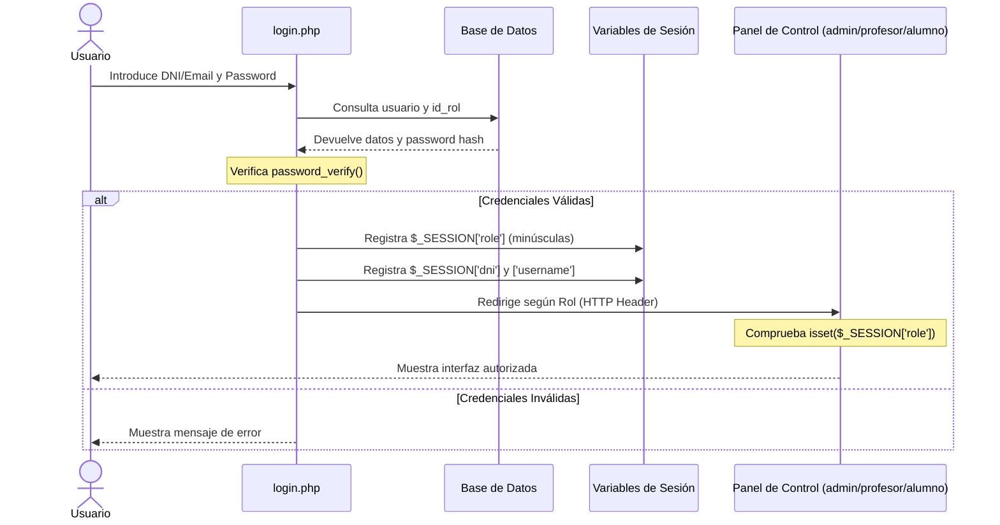

# 🌐 Documentación Técnica: Aplicación Web del Parking Iliberis (PHP & RBAC)

Este módulo constituye la **capa de presentación, administración y lógica de negocio (Frontend/Backend)** del sistema del parking automatizado. Ofrece un portal web responsive estructurado bajo un modelo de control de accesos basado en roles (RBAC) y actúa como la pasarela receptora (API) para el hardware y el sistema de visión artificial.

---

## 📂 Mapa Completo de Archivos y Arquitectura

Para asegurar un mantenimiento óptimo del código, los ficheros del portal se distribuyen de la siguiente forma:

### 📁 Archivos en la Raíz del Proyecto
*   **`index.php`**: Archivo de redirección raíz. Intercepta solicitudes entrantes y realiza una redirección limpia (HTTP 302) hacia `login.php`, evitando accesos prohibidos a directorios del servidor (errores 403).
*   **`login.php`**: Interfaz de autenticación unificada. Valida credenciales contra la base de datos (DNI o Email) mediante `password_verify()` y gestiona la seguridad de la sesión.
*   **`logout.php`**: Destruye la sesión activa de forma segura y redirige al login.
*   **`conexion.php`**: Módulo de conexión a MySQL. Lee las variables del entorno en caliente (`DB_HOST`, `DB_USER`, `DB_PASSWORD`, `DB_NAME`), permitiendo un despliegue transparente tanto en XAMPP local como en contenedores Docker de producción.
*   **`telegram_config.php`**: Contiene la función modular `enviarMensajeTelegram()`, que despacha peticiones HTTP POST cURL a la API de bots de Telegram con formato HTML enriquecido.
*   **`api_camara.php`**: El punto de enlace (API endpoint) HTTP POST del sistema. Recibe peticiones del script central en Python (`program.py`) para registrar las lecturas físicas en tiempo real.
*   **`header.php` / `footer.php`**: Cabecera y pie de página de la interfaz de login externa.
*   **`header2.php` / `footer2.php`**: Cabecera y pie de página modulares de la interfaz de usuario autenticado (cargan el menú de navegación, fuentes e iconos).

---

### 📁 Directorio `admin/` (Panel de Control Total)
Reservado exclusivamente para usuarios con rol `administrador`. Da acceso a las siguientes herramientas de auditoría y gestión:

*   **`index.php`**: Tablero principal del administrador. Lista a todos los usuarios con sus DNI, email, teléfono, rol y matrícula asociada mediante un **SQL LEFT JOIN** entre las tablas `usuarios` y `vehiculos`. Incluye un motor de búsqueda por texto (DNI/Nombre) y un filtro rápido de roles.
*   **`formulario_usuario.php`**: Interfaz de registro para añadir nuevos usuarios y sus vehículos asociados de forma conjunta.
*   **`guardar_usuario.php`**: Procesa el formulario anterior. Genera contraseñas cifradas seguras mediante `password_hash()` con el algoritmo `PASSWORD_DEFAULT`, inserta al usuario en la BD y registra su matrícula en la tabla de vehículos.
*   **`borrar_usuario.php`**: Permite al administrador seleccionar usuarios de la lista mediante botones dinámicos y los elimina llamando a `borrar2_usuario.php`.
*   **`borrar2_usuario.php`**: Script silencioso que ejecuta la sentencia `DELETE` y gestiona la redirección.
*   **`actualizar_usuario.php`**: Menú interactivo de selección de usuarios para su edición. Redirige al asistente de actualización `actualizar2_usuario.php`.
*   **`actualizar2_usuario.php`**: Formulario dinámico que recupera y muestra los datos vigentes del usuario/vehículo seleccionado para su modificación.
*   **`actualizar3_usuario.php`**: Procesa la actualización de los datos del usuario y del vehículo utilizando transacciones SQL consistentes.
*   **`historial_accesos.php`**: Panel de auditoría de seguridad. Lista todas las entradas y salidas de vehículos registradas en el parking, mostrando marcas de tiempo precisas y la dirección del flujo de acceso.
*   **`ver_incidencias.php`**: Listado de coches reportados por mal aparcamiento. Permite filtrar dinámicamente por matrícula, propietario o fecha, facilitando la supervisión de infractores.
*   **`ver_intentos.php`**: Monitor de intrusos. Muestra una tabla con todas las matrículas capturadas por las cámaras que no constan en la base de datos de vehículos autorizados, identificando vehículos no registrados o errores en el OCR.
*   **`control_barrera.php`**: Interfaz de accionamiento manual. Permite al administrador forzar y simular movimientos seleccionando vehículos desde un buscador de autocompletado en caliente (HTML5 `<datalist>` conectado a la base de datos).
*   **`registrar_acceso.php`**: Procesa la acción manual e inserta registros de `ENTRADA` o `SALIDA` en MySQL de forma inmediata.

---

### 📁 Directorio `profesor/` (Panel del Personal Docente)
Panel optimizado para facilitar la autogestión de los docentes del centro escolar:

*   **`index.php`**: Cuadro de mando del profesor. Presenta su perfil, su vehículo autorizado, el historial con sus últimos 5 accesos registrados en el parking y un acceso directo para reportar incidencias.
*   **`editar_perfil.php`**: Formulario interactivo que permite al docente modificar y actualizar sus propios datos de contacto (Email y Teléfono).
*   **`editar_vehiculo.php`**: Permite al profesor actualizar de forma autónoma la matrícula, marca y modelo del vehículo que utilizará para acceder al centro escolar.
*   **`plazas.php`**: Consulta gráfica en tiempo real. Interroga la tabla `plazas` en la base de datos y muestra casillas dinámicas con el estado de ocupación de cada espacio físico (Verde para libre, Rojo para ocupada), sincronizadas directamente con los sensores de hardware administrados por Python.
*   **`reportar_mal_aparcado.php`**: El canal de incidencias activo.
    1.  El profesor escribe una matrícula sospechosa y un motivo opcional.
    2.  El backend valida la existencia de la matrícula y aplica una regla de **Anti-Passback**: el sistema comprueba en MySQL si el último registro del vehículo es de `ENTRADA`. Si no figura dentro del parking, deniega el reporte inmediatamente con un mensaje descriptivo para evitar falsas alertas.
    3.  Si se confirma que está dentro, inserta la incidencia en `reportes_mal_aparcado` y llama al webhook de Telegram. Este despacha una notificación enrich-HTML automática al canal de profesores con la matrícula, el propietario y el motivo indicado para que el infractor retire el coche.

---

### 📁 Directorio `alumno/` (Panel de Consulta de Alumnado)
Panel con acceso limitado y seguro para el cuerpo estudiantil del instituto:

*   **`index.php`**: Tablero del alumno. Diseñado como **interfaz de solo lectura** por motivos de seguridad. Muestra su DNI, datos de contacto, vehículos matriculados a su nombre y sus últimos 5 movimientos físicos en la barrera. Redirige formalmente a secretaría para cualquier trámite de modificación.
*   **`plazas.php`**: Permite a los alumnos visualizar en tiempo real la ocupación de las plazas de aparcamiento y gestionar sus trayectos con previsión del aforo libre.

---

## 🔐 Seguridad, Autenticación y Flujo RBAC

La aplicación implementa un sistema robusto de **Control de Accesos Basado en Roles (RBAC)** con validación de seguridad a tres niveles:



### Reglas Críticas de Seguridad en PHP:
1.  **Cifrado de Contraseñas:** En lugar de MD5 o texto plano, se usa `password_hash()` con salting automático en `guardar_usuario.php` y `password_verify()` en `login.php`.
2.  **Validación de Cabecera Aislada:** Cada panel realiza comprobaciones de sesión estrictas al principio del archivo para interceptar a usuarios que intenten saltar la autenticación escribiendo URLs directas en la barra de direcciones:
    ```php
    // Ejemplo en el panel de Administración:
    session_start();
    if (!isset($_SESSION['role']) || strtolower(trim($_SESSION['role'])) !== 'administrador') {
        header("Location: ../login.php");
        exit;
    }
    ```
3.  **Sanitización de Consultas SQL:** Las entradas de formularios y filtros se limpian con `mysqli_real_escape_string()` y `trim()` para neutralizar vectores de inyección SQL.

---

## 🐳 Integración de Red y Orquestación Docker

El portal web está preparado para funcionar como un microservicio independiente en una arquitectura de contenedores Docker:

*   **Despliegue Integrado con SSL (Puerto 443):** En el archivo general de orquestación, el contenedor web (Apache+PHP) está diseñado con un mecanismo de espera. Aguarda automáticamente a que el contenedor de Certbot complete la solicitud y validación de los certificados SSL/TLS con Let's Encrypt (usando el plugin DNS Cloudflare) antes de arrancar los puertos seguros, garantizando conexiones cifradas en producción.
*   **Enlace de Volúmenes (Desarrollo en Caliente):** El código fuente de `aplicacion-web/` se monta directamente sobre la ruta pública de Apache `/var/www/html/` en el contenedor. Esto permite editar código PHP o retocar archivos CSS y ver los resultados en el navegador en caliente, sin necesidad de compilar o reconstruir contenedores.
*   **Acceso a la API en Caliente:** El script `api_camara.php` recibe llamadas JSON/POST de la Raspberry Pi sobre el protocolo HTTPS, traduciendo eventos de hardware a registros MySQL persistentes de forma instantánea.

---
*Módulo desarrollado y maquetado por Imad y Héctor.*
